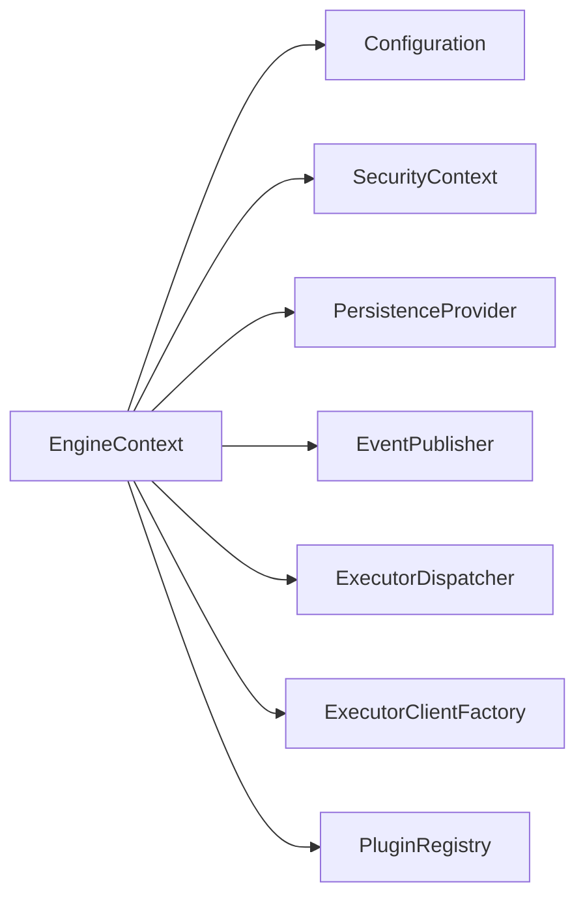
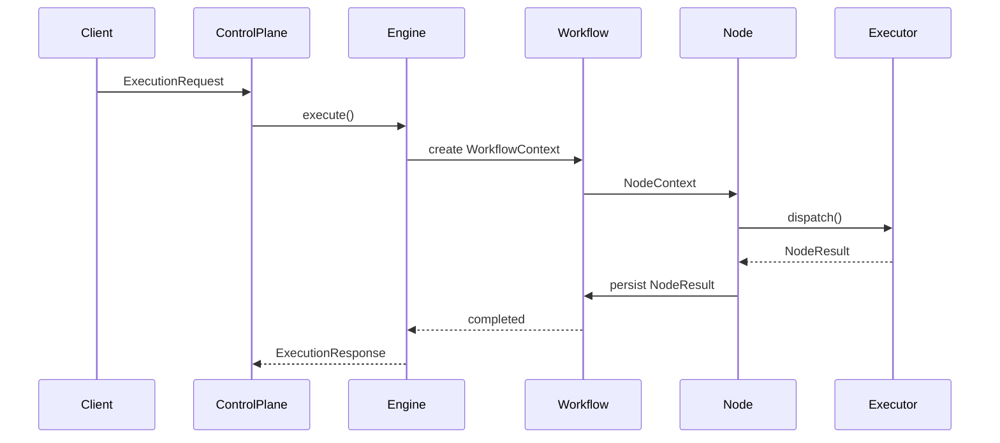
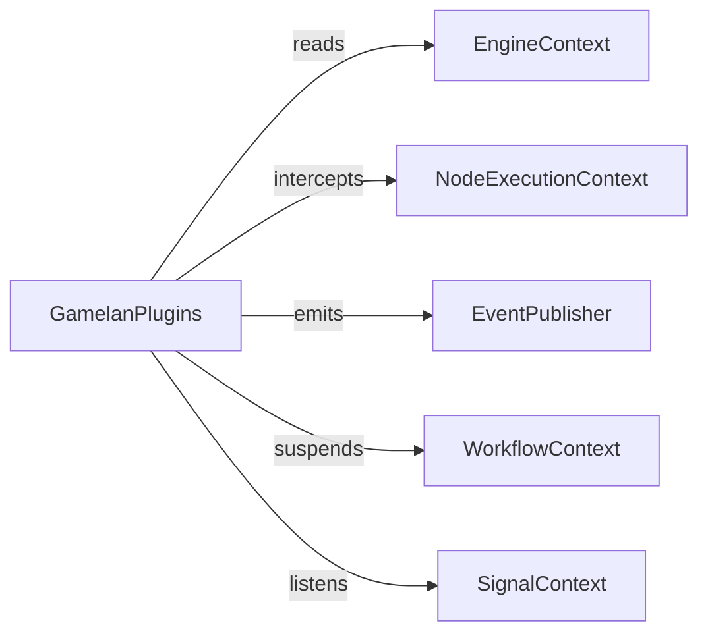
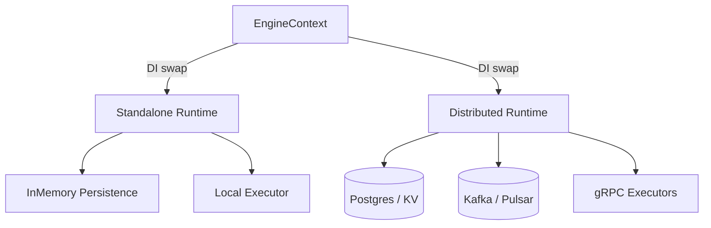
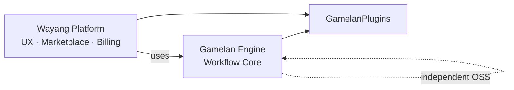

Yes — this is the **right moment** to visualize it, because now the architecture is **complete and stable**.

Below I’ll give you **one clear, authoritative architecture diagram**, then **layered breakdowns**, all **mapped exactly to the refactored engine layout you approved**.

I’ll use **Mermaid** so you can paste it into:

* GitHub
* GitLab
* Obsidian
* Mermaid Live
* docs site

---

## 1️⃣ **Gamelan Engine – Full Architecture (Authoritative Diagram)**

```mermaid
flowchart TB

%% ========= External =========
User[User / API Client]
Gateway[Iket API Gateway<br/>mTLS · JWT · RateLimit]
Wayang[Wayang Platform<br/>Low-code Agentic AI]

User --> Gateway
Wayang --> Gateway

%% ========= Control Plane =========
Gateway --> CP[Gamelan Control Plane<br/>REST · gRPC]

%% ========= Engine Runtime =========
CP -->|ExecutionRequest| Engine[Gamelan Engine Runtime]

subgraph Engine["Gamelan Engine (engine-core)"]
    
    Bootstrap[EngineBootstrap]
    EngineCtx[EngineContext]

    Bootstrap --> EngineCtx

    EngineCtx -->|provides| Config[Configuration]
    EngineCtx -->|provides| Security[SecurityContext]
    EngineCtx -->|provides| Persistence[PersistenceProvider]
    EngineCtx -->|provides| Events[EventPublisher]
    EngineCtx -->|provides| ExecDisp[ExecutorDispatcher]
    EngineCtx -->|provides| ExecFactory[ExecutorClientFactory]
    EngineCtx -->|provides| Plugins[PluginRegistry]

    Engine --> WorkflowEngine[WorkflowEngine]
    WorkflowEngine --> WorkflowCtx[WorkflowContext]

    WorkflowEngine --> NodeCtx[NodeContext]
    NodeCtx --> NodeExecCtx[NodeExecutionContext]

    NodeExecCtx --> ExecDisp
    ExecDisp --> ExecFactory
end

%% ========= Executors =========
subgraph Executors["Executors (Polyglot, Remote)"]
    JavaExec[Java Executor]
    PyExec[Python Executor]
    WasmExec[WASM Runtime]
end

ExecFactory --> JavaExec
ExecFactory --> PyExec
ExecFactory --> WasmExec

%% ========= Plugins =========
subgraph GamelanPlugins["Plugin Runtime"]
    BPMN[BPMN Engine Plugin]
    ACP[Human Approval / Policy Plugin]
    A2A[A2A / MCP Plugin]
    WASMPolicy[WASM Policy Plugin]
end

GamelanPlugins --> BPMN
GamelanPlugins --> ACP
GamelanPlugins --> A2A
GamelanPlugins --> WASMPolicy

%% ========= Events / Signals =========
WorkflowEngine -->|emit| Events
Events --> Persistence

External[Human · Timer · Webhook · Agent]
External -->|SignalContext| WorkflowEngine
```

---

## 2️⃣ **EngineContext Spine (Zoomed In)**

This is the **non-negotiable core**.



📌 **Rule**
Nothing bypasses `EngineContext`.
Everything important flows through it.

---

## 3️⃣ **Execution Flow (Request → Result)**



---

## 4️⃣ **Plugin Interaction Model**

This shows **why your plugin system is already strong**.



Examples:

* BPMN plugin → tokens + signals
* ACP plugin → suspend/resume
* WASM plugin → beforeExecution guard
* A2A plugin → agent-to-agent events

---

## 5️⃣ **Standalone vs Distributed Runtime**



🔑 **Engine code does NOT change**
Only implementations behind interfaces do.

---

## 6️⃣ Example Implementation: **Wayang ↔ Gamelan Product Boundary (Strategic View)**



This **perfectly supports your strategy**:

* Gamelan = engine OSS + enterprise extensions
* Wayang = product, UX, monetization
* Acquisition-safe ✔️

---

## 7️⃣ Final Sanity Check

After this architecture:

✔ No missing core contracts
✔ No circular dependencies
✔ Plugins are first-class
✔ Executors are replaceable
✔ ACP / BPMN / A2A fit naturally
✔ Control plane is thin
✔ Engine is reusable
✔ Strategy-aligned

---


