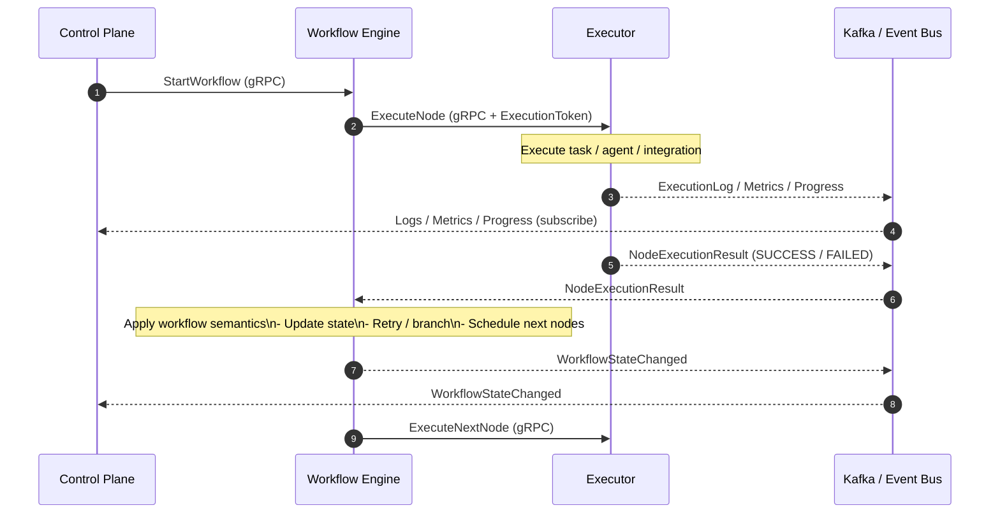

Below is a **Mermaid sequence diagram** that shows:

* **Commands** going down via gRPC
* **Facts** flowing up via events
* **Executor emitting to BOTH**:

  * Workflow Engine (**semantic facts**)
  * Control Plane (**observability only**)
* **Workflow Engine remains the authority**

---

### Mermaid Sequence Diagram

(copy–paste into any Mermaid-enabled viewer)



---

## How to Read This Diagram (Key Points)

### 1. Two Separate “Upward” Channels

| Channel                            | Purpose                 | Authority       |
| ---------------------------------- | ----------------------- | --------------- |
| Executor → Kafka → Control Plane   | Logs, progress, metrics | ❌ No authority  |
| Executor → Kafka → Workflow Engine | NodeExecutionResult     | ✅ Authoritative |

Even though **both use Kafka**, they serve **different semantic layers**.

---

### 2. Control Plane Never Drives Workflow Logic

Notice:

* Control Plane **never reacts directly** to `NodeExecutionResult`
* It only reacts to `WorkflowStateChanged`

This prevents:

* Race conditions
* Inconsistent UI
* Security escalation

---

### 3. Workflow Engine Is Always Notified

Even if:

* Executor streams tokens
* Executor sends progress
* Executor sends logs

👉 **The Workflow Engine still receives the final semantic fact**
That’s the contract.

---

## Enforcing This in Practice (Strong Recommendation)

### Topic-level separation

```text
executor.observability.*
executor.semantic.results
workflow.state.changes
```

### ACL rule

| Producer        | Topic            | Allowed |
| --------------- | ---------------- | ------- |
| Executor        | observability.*  | ✅       |
| Executor        | semantic.results | ✅       |
| Executor        | workflow.state.* | ❌       |
| Workflow Engine | workflow.state.* | ✅       |

This makes violations **physically impossible**.

---

## One-line Mental Model (Diagram Summary)

> **Executors speak facts.
> Workflow Engine interprets facts.
> Control Plane listens to interpretations.**

---

If you want next, I can:

* Convert this into **C4 diagrams**
* Provide **protobuf + event schema**
* Show **Quarkus + Kafka code structure**
* Map this to **Temporal / Cadence equivalence**

Just tell me.
